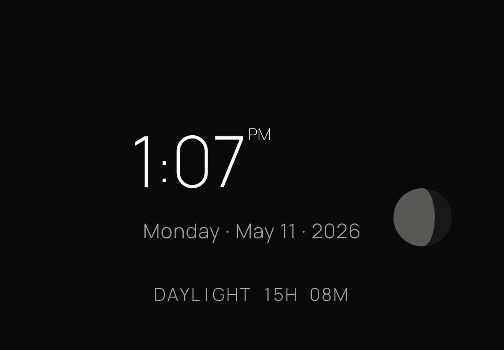
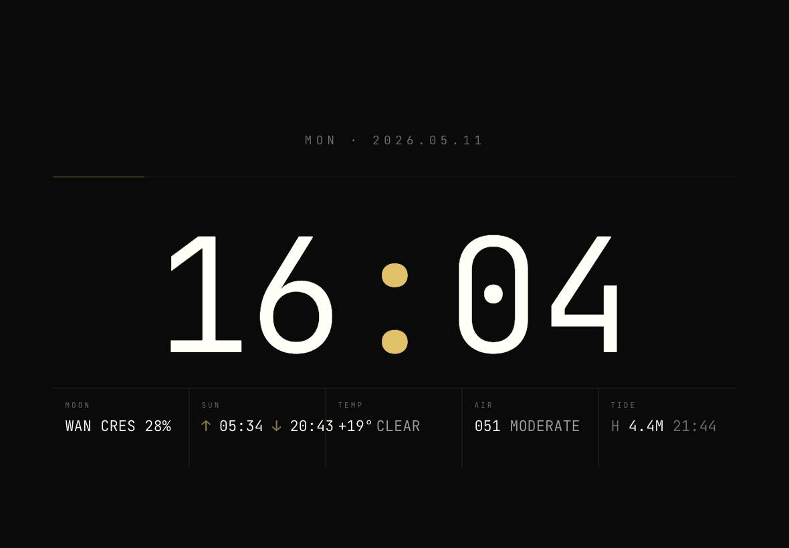
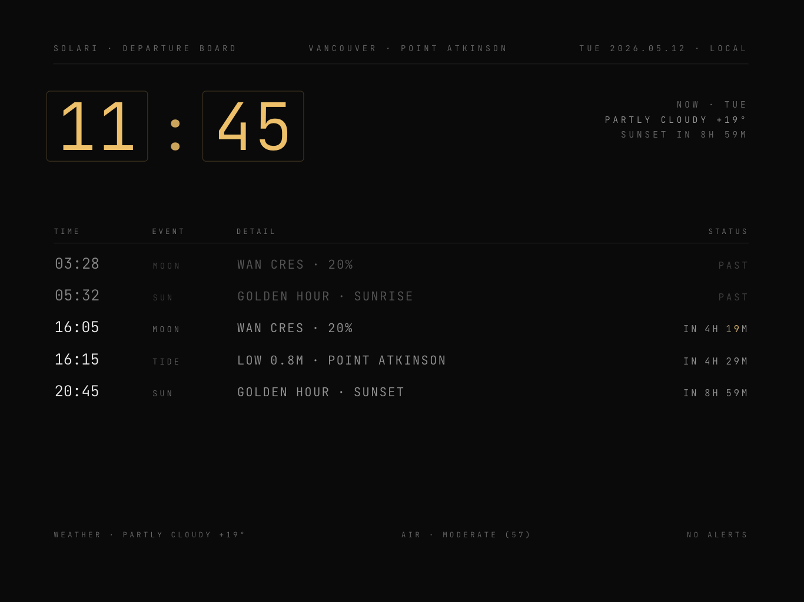
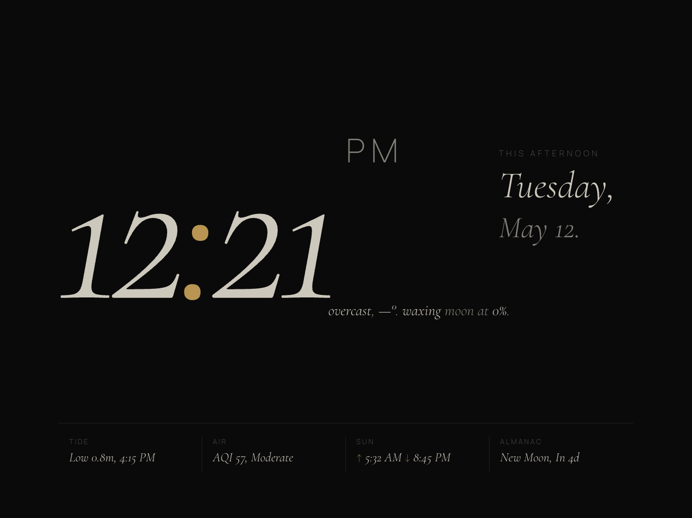
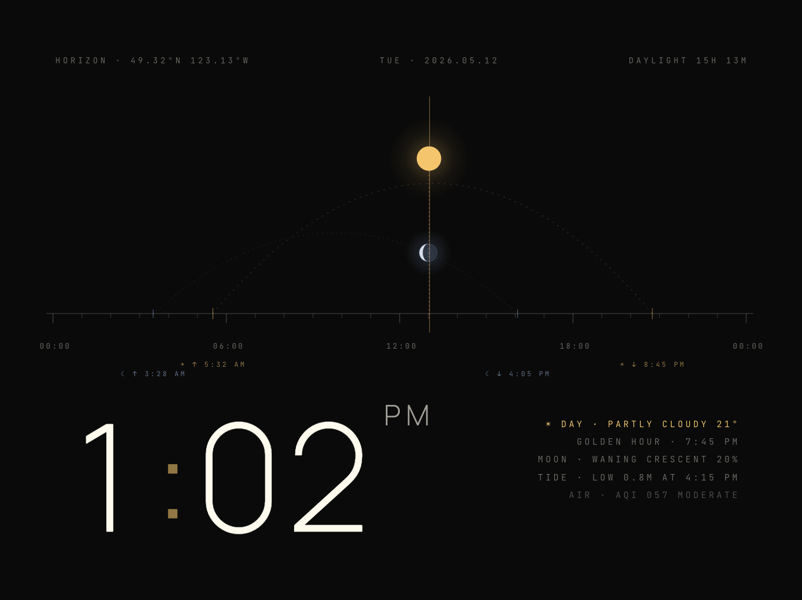

# Solari

An ambient display for iPad, showing time, weather, tides, moon phase, and astronomical events for Vancouver, BC.

Solari is a beautiful object first, a quiet sense of rhythm second, a source of facts third. It runs 24/7 in a living room, never demanding attention. Named after the Solari split-flap departure boards -- the kinetic split-flap transitions are the signature detail.

Live: [joshuascottpaul.github.io/solari](https://joshuascottpaul.github.io/solari/)

## What it shows

- Time and date
- Current weather and temperature
- Air quality index (AQI)
- Tide times (Point Atkinson, DFO)
- Moon phase disc
- Astronomical events: sunrise, sunset, civil twilight, golden hour
- Upcoming almanac events: meteor showers, eclipses
- Holiday and custom observances

## Key features

- 5 selectable clockfaces: Calm, Mechanical, Departures, Editorial, Horizon (V1 feature complete)
- Split-flap kinetic transitions on rotating content slots
- Sky-colored typography that shifts with sun altitude, weather, and observances
- 8-layer burn-in protection: Perlin drift, pixel-shift, kinetic churn, macro position shifts, sky-color modulation, luminance breath, daily 03:00 refresher cycle, and rendering hygiene
- Perlin-noise drift with coprime periods keeps every element in slow, independent motion

## Faces

Long-press the time numerals or moon disc for 600 ms to open the picker, or navigate directly to `/clockface.html`. Each face is a distinct voice on the same underlying engine.

### Calm

The default. Manrope 200 time at 165 px, single rotating slot, moon disc bottom-right. Quiet, centered, minimal.



### Mechanical

JetBrains Mono 300 tabular numerals at 236 px with gold colon, five-column complications grid (MOON / SUN / TEMP / AIR / TIDE) at the bottom, minute-arc hairline at the top.



### Departures

The Solari namesake. Split-flap board with gold-bezel hour-minute flap pair, five rotating event rows (sun/tide/moon/almanac), per-character cascade animation on row updates, header strip and footer chrome.



### Editorial

Magazine-cover composition. Cormorant Garamond 300 italic time at 360 px on the left, mirrored right-column kicker + weekday + monthday block, rotating literary almanac paragraph that cross-fades every 32 seconds. Layout flips every 6 hours.



### Horizon

Astronomy as truth. Full-stage SVG diagram with sun and moon arcs, 25 hour ticks, phase-correct moon crescent, dipping behind the horizon line at rise and set. Gold hairline cursor sweeps left-to-right over 24 hours. Big time in the bottom corner, status block right.



## Technology

Vanilla HTML, CSS, and JavaScript. No framework, no build step, no API keys. Total size: approximately 256 KB uncompressed (V1 complete, all 5 faces shipped). Deployed as static files via GitHub Pages.

Vendored libraries in `lib/` (both MIT-licensed): SunCalc for astronomical calculations, Perlin for noise generation.

External data comes from free public APIs: Open-Meteo (weather, AQI), DFO IWLS (tides), Environment Canada (weather alerts).

## Run locally

```
python3 -m http.server 8000
```

Open `http://localhost:8000` in a browser. Use Safari on iPad for final verification.

## Deploy

Push to `main`. GitHub Pages serves the files directly -- no build step required.

## iPad setup

1. Open `https://joshuascottpaul.github.io/solari/` in Safari.
2. Tap Share, then Add to Home Screen.
3. Open the app from the home screen (enables full-screen, hides browser chrome).
4. Plug in the iPad and set it in a fixed landscape position.

### Recommended settings

| Setting | Value |
|---|---|
| Auto-Lock | Never |
| Auto-Brightness | On |
| Reduce White Point | On, approximately 25% |
| True Tone | On |
| Display brightness | 40-60% |

### Monthly maintenance

Power-cycle the iPad for 30 minutes once a month to allow full thermal rest.

## Configuration

Edit the `CONFIG` object at the top of `app.js`. Key options:

| Key | Default | Description |
|---|---|---|
| `display.timeFormat` | `'12h'` | `'12h'` or `'24h'` |
| `display.showSeconds` | `false` | Show seconds in time display |
| `observances.customObservances` | `[]` | Add custom dates with name, glyph, palette, and treatment |
| `refresher.enabled` | `true` | Enable daily 03:00 burn-in refresher |
| `luminanceBreath.enabled` | `true` | Enable 30-minute luminance oscillation |

To add a custom observance, uncomment and edit the example entry in `CONFIG.observances.customObservances`.

## License

Source code is MIT-licensed. Vendored libraries (`lib/suncalc.js`, `lib/perlin.js`) are also MIT-licensed.
